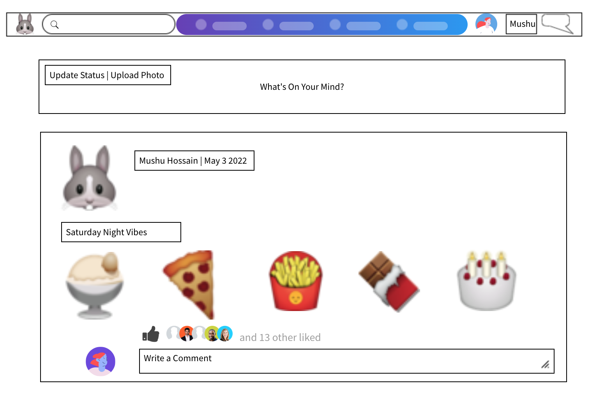
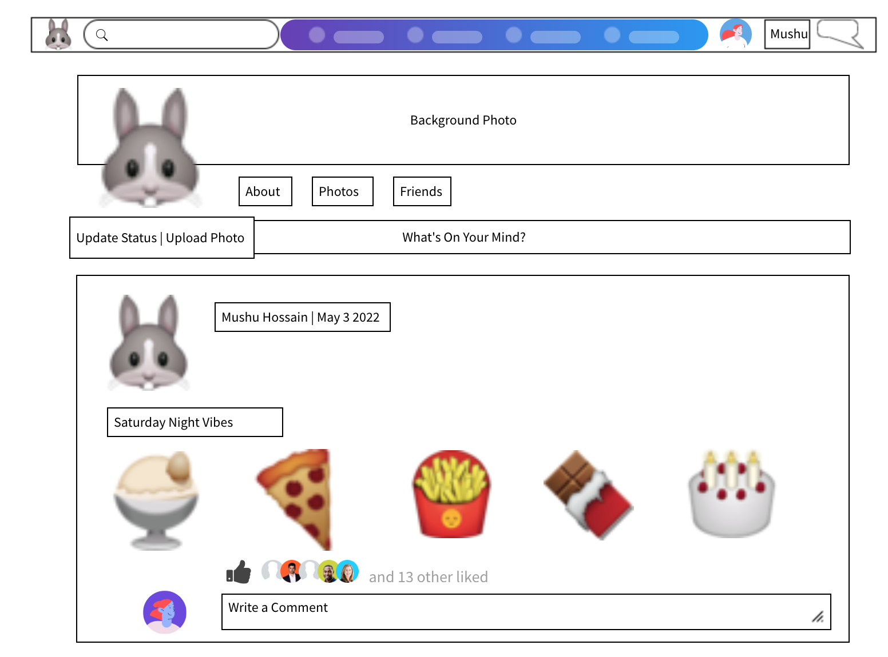
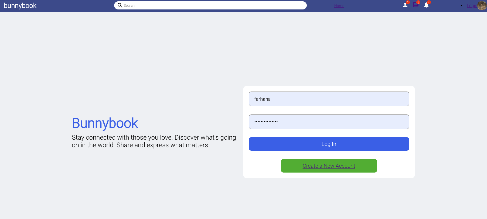
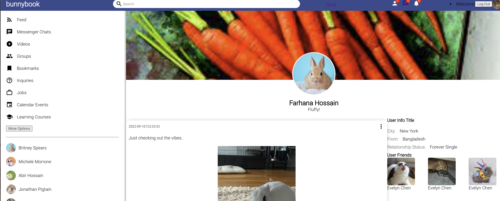

# Bunnybook
Bunnybook is a playful take on the ever so popular Facebook. Instead of connecting humans together, Bunnybook connects all bunnies together. Each bunny will be able to create their own user profile in order to post statuses, upload images, and comment on posts from all users (including their own). Additionally, bunny users will be able to update and delete their posts and comments as needed. Authentication (login/logout) will also be included for all users.

# Links
Github Front-End: https://github.com/fhossain97/Bunnybook
Github Back-End: https://github.com/fhossain97/BB-backend
<!-- Heroku Front-End: https://bunnyfront.herokuapp.com/
Heroku Back-End: https://bunnyback.herokuapp.com/ -->

# Technologies 
- Frontend: React
- Backend: Django and Django Rest Framework
- Additional: Cloudinary

# MVP (user)
- As a user, I want to create my own username and password
- As a user, I want to upload images/photos.
- As a user, I want to have create, update, and delete functionality on posts created

# MVP (users)
- As users, we want to see all posts on the homepage from all bunnies
- As users, we want to be able to only delete and edit posts

# Stretch Goals
- Messaging app: Users can message one another (with message box)
- Post emojis: Like and dislike posts
- What's on your mind?: Users can add status updates
- Search Bar
- As a user, I want to comment on other posts, including that of my own 
- As a user, I want to have create, update, and delete functionality on comments created
- As a user, I want to have create, update, and delete functionality on comments created

# Wireframes

<!-- Home-Page Mock Up:

Profile Mock Up:

# Site 

Login:

Sign-Up:

Home-Page:

Profile:
 -->

# Installation Instructions
Fork repository from Github. Clone repository on your desktop.

# Methods
Following various documentations for Django and React. Referencing facebook and social media mock-ups for samples and inspiration.

# Future Code
- Implement Strech Goals
- Webpage needs more dynamic aspects (profile, friends, etc)
- Needs additional user model inputs (profile pic, friend list, etc.)

