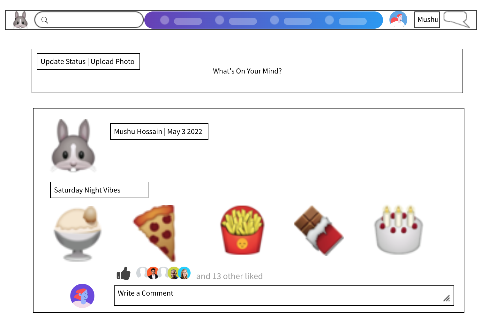
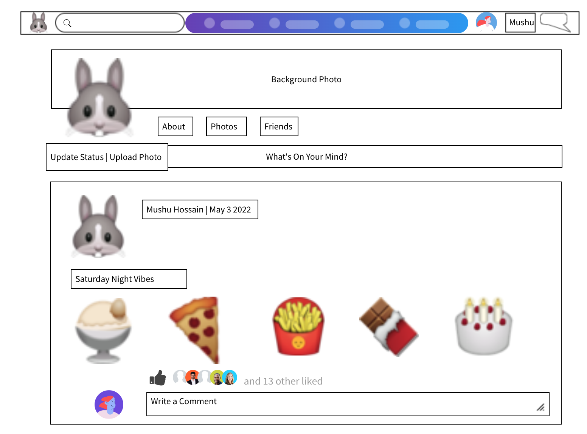

# Bunnybook
Bunnybook is a playful take on the ever so popular Facebook. Instead of connecting humans together, Bunnybook connects all bunnies together. Each bunny will be able to create their own user profile in order to post statuses, upload images, and comment on posts from all users (including their own). Additionally, bunny users will be able to update and delete their posts and comments as needed. Authentication (login/logout) will also be included for all users.

# Technologies 
Front - end: React
Backend: Django and Django rest Framework

# MVP (user)
-As a user, I want to create my own username and password
-As a user, I want to comment on other posts, including that of my own 
-As a user, I want to upload images/photos.
-As a user, I want to have create, update, and delete functionality on posts and comments created

# MVP (users)
-As users, we want to see all posts on the homepage from all bunnies
-As users, we want to be able to only delete and edit our own comments on all posts

# Stretch Goals
-Messaging app: Users can message one another (with message box)
-Post emojis: Like and dislike posts
-What's on your mind?: Users can add status updates
-Search Bar

# Wireframes

Home-Page Mock Up:

Profile Mock Up:
